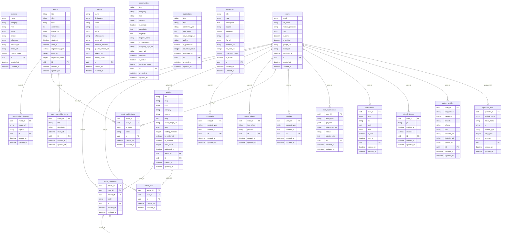

# ER diagram

Entity-relationship view of the CHEA schema, generated from the SQLAlchemy models. Rendered by any Mermaid-aware viewer (including GitHub).

```mermaid
erDiagram
    article_comments {
        uuid article_id "FK"
        uuid user_id "FK"
        uuid parent_id "FK"
        string body
        uuid id "PK"
        datetime created_at
        datetime updated_at
    }
    article_likes {
        uuid article_id "FK"
        uuid user_id "FK"
        uuid id "PK"
        datetime created_at
        datetime updated_at
    }
    articles {
        string title
        string slug
        string kind
        string category
        string excerpt
        text body
        string cover_image_url
        array tags
        integer reading_minutes
        boolean is_published
        boolean is_featured
        integer view_count
        datetime published_at
        uuid author_id "FK"
        uuid id "PK"
        datetime created_at
        datetime updated_at
    }
    bookmarks {
        uuid user_id "FK"
        string content_type
        uuid content_id
        uuid id "PK"
        datetime created_at
        datetime updated_at
    }
    contacts {
        string name
        string category
        string role
        string email
        string phone
        string whatsapp
        string linkedin_url
        string photo_url
        integer display_order
        uuid id "PK"
        datetime created_at
        datetime updated_at
    }
    device_tokens {
        uuid user_id "FK"
        string fcm_token
        string platform
        uuid id "PK"
        datetime created_at
        datetime updated_at
    }
    event_gallery_images {
        uuid event_id "FK"
        string image_url
        string caption
        uuid id "PK"
        datetime created_at
        datetime updated_at
    }
    event_registrations {
        uuid event_id "FK"
        uuid user_id "FK"
        string qr_token
        string status
        uuid id "PK"
        datetime created_at
        datetime updated_at
    }
    event_schedule_items {
        uuid event_id "FK"
        string title
        string description
        datetime starts_at
        uuid id "PK"
        datetime created_at
        datetime updated_at
    }
    events {
        string title
        string slug
        string type
        text description
        string banner_url
        string venue
        datetime starts_at
        datetime ends_at
        boolean registration_open
        integer capacity
        integer registered_count
        uuid id "PK"
        datetime created_at
        datetime updated_at
    }
    faculty {
        string name
        string designation
        string email
        string phone
        string office
        string office_hours
        string photo_url
        array research_interests
        string google_scholar_url
        string linkedin_url
        integer display_order
        uuid id "PK"
        datetime created_at
        datetime updated_at
    }
    favorites {
        uuid user_id "FK"
        string content_type
        uuid content_id
        uuid id "PK"
        datetime created_at
        datetime updated_at
    }
    form_submissions {
        uuid user_id "FK"
        string form_type
        jsonb payload
        string attachment_url
        string status
        text admin_note
        uuid id "PK"
        datetime created_at
        datetime updated_at
    }
    notifications {
        uuid user_id "FK"
        string type
        string title
        text body
        jsonb data
        boolean is_read
        datetime sent_at
        uuid id "PK"
        datetime created_at
        datetime updated_at
    }
    opportunities {
        string type
        string company
        string role
        string location
        boolean is_remote
        text description
        text eligibility
        array required_skills
        string compensation
        string company_logo_url
        string apply_url
        datetime deadline
        boolean is_active
        integer applicant_count
        uuid id "PK"
        datetime created_at
        datetime updated_at
    }
    publications {
        string title
        string type
        string academic_year
        text description
        string cover_image_url
        string pdf_url
        boolean is_published
        integer download_count
        datetime published_at
        uuid id "PK"
        datetime created_at
        datetime updated_at
    }
    refresh_tokens {
        uuid user_id "FK"
        string jti
        datetime expires_at
        boolean revoked
        uuid id "PK"
        datetime created_at
        datetime updated_at
    }
    resources {
        string title
        string type
        text description
        string subject
        integer semester
        array tags
        string file_url
        string external_url
        integer file_size_kb
        integer download_count
        boolean is_active
        uuid id "PK"
        datetime created_at
        datetime updated_at
    }
    student_profiles {
        uuid user_id "FK"
        string roll_number
        integer semester
        string branch
        string phone
        string bio
        string resume_url
        string linkedin_url
        string github_url
        uuid id "PK"
        datetime created_at
        datetime updated_at
    }
    uploaded_files {
        uuid uploader_id "FK"
        string original_name
        string stored_name
        string url
        string content_type
        integer size_bytes
        string purpose
        uuid id "PK"
        datetime created_at
        datetime updated_at
    }
    users {
        string email
        string full_name
        string hashed_password
        string role
        boolean is_active
        boolean is_verified
        string google_sub
        string avatar_url
        datetime last_login_at
        uuid id "PK"
        datetime created_at
        datetime updated_at
    }
    articles ||--o{ article_comments : "article_id"
    users ||--o{ article_comments : "user_id"
    article_comments ||--o| article_comments : "parent_id"
    articles ||--o{ article_likes : "article_id"
    users ||--o{ article_likes : "user_id"
    users ||--o| articles : "author_id"
    users ||--o{ bookmarks : "user_id"
    users ||--o{ device_tokens : "user_id"
    events ||--o{ event_gallery_images : "event_id"
    events ||--o{ event_registrations : "event_id"
    users ||--o{ event_registrations : "user_id"
    events ||--o{ event_schedule_items : "event_id"
    users ||--o{ favorites : "user_id"
    users ||--o{ form_submissions : "user_id"
    users ||--o| notifications : "user_id"
    users ||--o{ refresh_tokens : "user_id"
    users ||--o{ student_profiles : "user_id"
    users ||--o| uploaded_files : "uploader_id"
```
